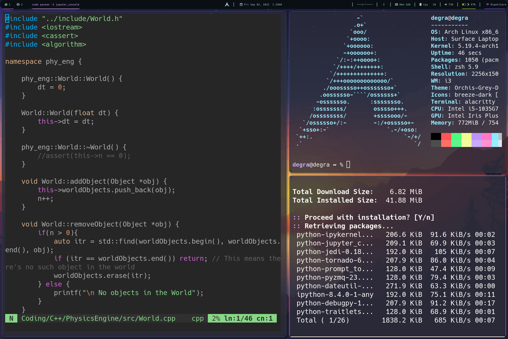
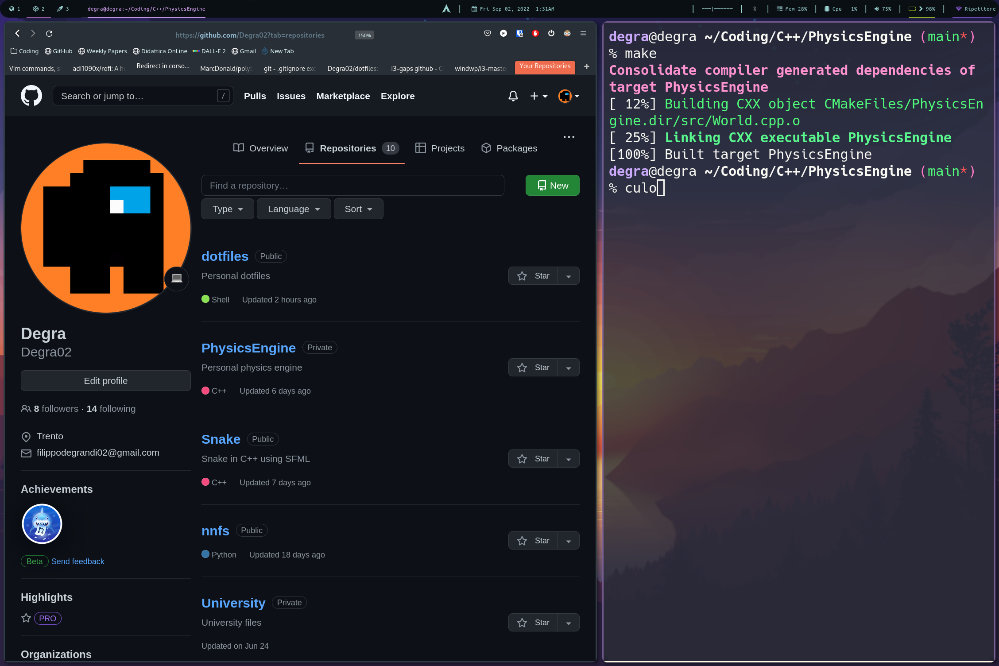

# dotfiles
i3wm using picom compositor, rofi and polybar.

i3 uses master and stack layout >> [i3-master-stack](https://github.com/windwp/i3-master-stack)

Locking is handled by i3lock, which uses blurlock.

## Screenshots

